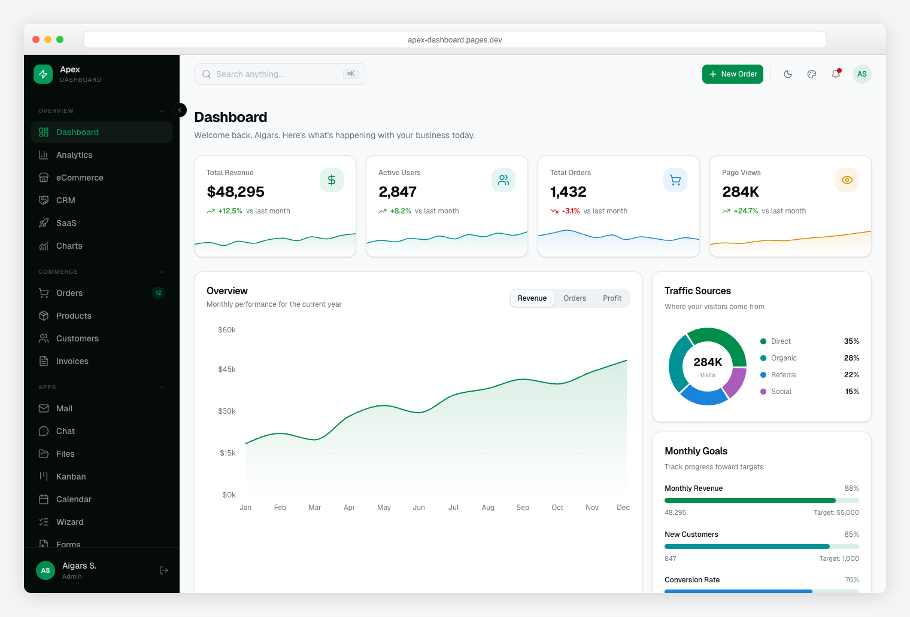
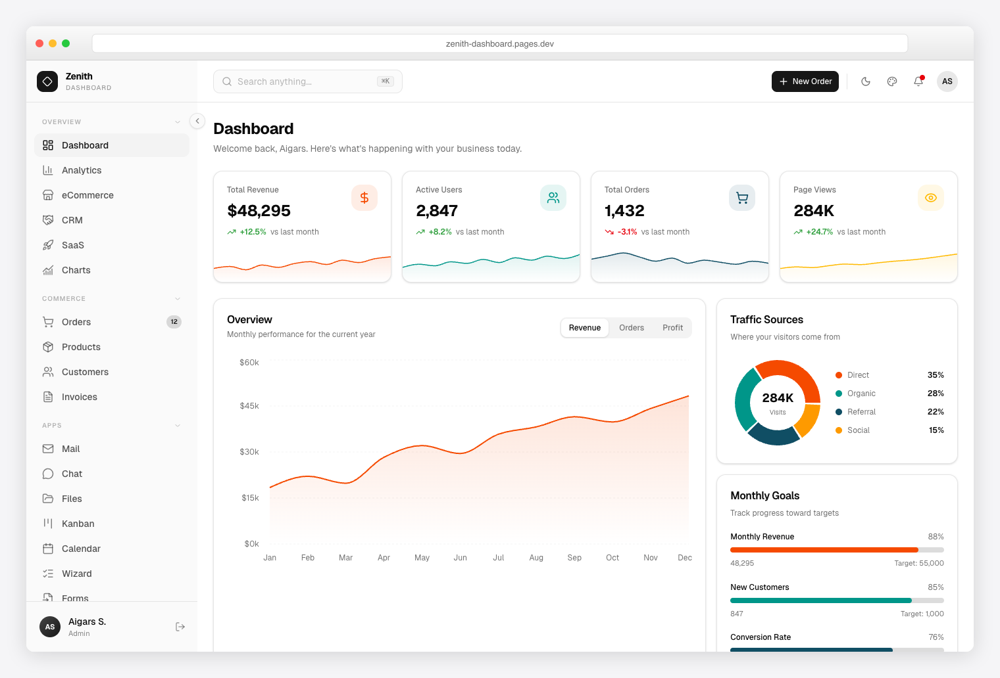
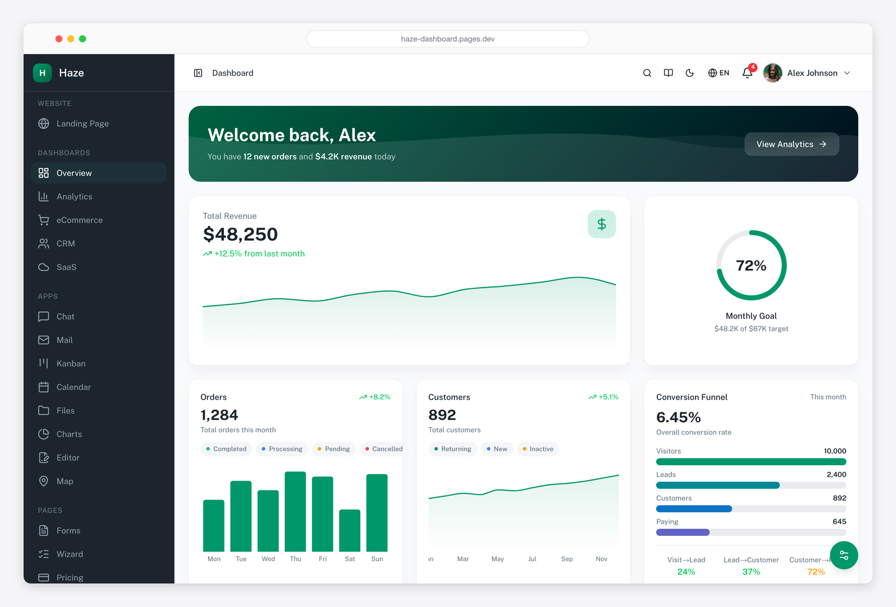
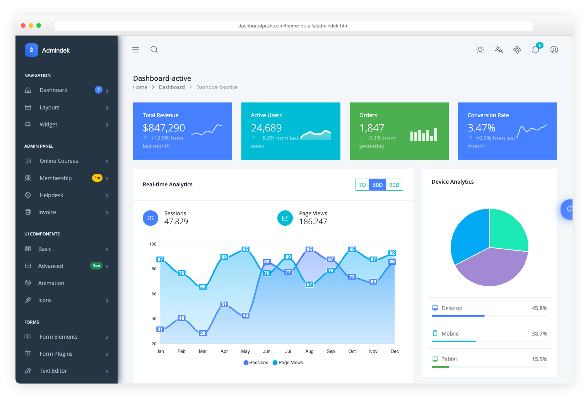

# DashboardPack

**Premium admin dashboard templates for every stack** — Bootstrap, React, Next.js,
Angular, Vue, Nuxt, Laravel, Django, shadcn/ui and Svelte. App-ready pages, dark mode,
clean code, and real support, at **[dashboardpack.com](https://dashboardpack.com/?utm_source=github&utm_medium=org-profile&utm_campaign=github-dashboardpack-profile)**.

  
  

  
  

## The lineup

| Template | Built with | Available for |
|---|---|---|
| **Apex** — 5 dashboards, 20+ app pages, 125+ routes, full CRUD | React 19 / Inertia | [Next.js](https://dashboardpack.com/theme-details/apex-dashboard-nextjs/?utm_source=github&utm_medium=org-profile&utm_campaign=github-dashboardpack-profile) · [Laravel](https://dashboardpack.com/theme-details/apex-dashboard-laravel/?utm_source=github&utm_medium=org-profile&utm_campaign=github-dashboardpack-profile) · [Django](https://dashboardpack.com/theme-details/apex-dashboard-django/?utm_source=github&utm_medium=org-profile&utm_campaign=github-dashboardpack-profile) · [Angular](https://dashboardpack.com/theme-details/apex-dashboard-angular/?utm_source=github&utm_medium=org-profile&utm_campaign=github-dashboardpack-profile) |
| **Zenith** — achromatic, ultra-minimal; 50+ pages, live theme customizer | shadcn/ui + Tailwind v4 | [Next.js](https://dashboardpack.com/theme-details/zenith-shadcn/?utm_source=github&utm_medium=org-profile&utm_campaign=github-dashboardpack-profile) · [Django](https://dashboardpack.com/theme-details/zenith-dashboard-django/?utm_source=github&utm_medium=org-profile&utm_campaign=github-dashboardpack-profile) |
| **Haze** — 92+ pages, 7 layouts, 5 dashboards, RTL, i18n | Nuxt UI v4 + Tailwind v4 | [Nuxt 4](https://dashboardpack.com/theme-details/haze-dashboard-nuxt/?utm_source=github&utm_medium=org-profile&utm_campaign=github-dashboardpack-profile) |
| **Admindek** — 100+ components, 10 color presets, RTL | Bootstrap 5 | [HTML](https://dashboardpack.com/theme-details/admindek-html/?utm_source=github&utm_medium=org-profile&utm_campaign=github-dashboardpack-profile) · [Laravel](https://dashboardpack.com/theme-details/admindek-dashboard-laravel/?utm_source=github&utm_medium=org-profile&utm_campaign=github-dashboardpack-profile) · [Next.js](https://dashboardpack.com/theme-details/admindek-nextjs/?utm_source=github&utm_medium=org-profile&utm_campaign=github-dashboardpack-profile) · [Angular](https://dashboardpack.com/theme-details/admindek-dashboard-angular/?utm_source=github&utm_medium=org-profile&utm_campaign=github-dashboardpack-profile) |
| **TailPanel** — 9 dashboard designs, dark & light | React + Tailwind + Vite | [React](https://dashboardpack.com/theme-details/tailpanel/?utm_source=github&utm_medium=org-profile&utm_campaign=github-dashboardpack-profile) |
| **SvelteForge Premium** — 30+ wired-up modules, multi-tenant | SvelteKit + Tailwind v4 | [SvelteKit](https://dashboardpack.com/theme-details/svelteforge-premium/?utm_source=github&utm_medium=org-profile&utm_campaign=github-dashboardpack-profile) |
| **ArchitectUI Pro** — the classic, all grown up | Bootstrap 5 | [HTML](https://dashboardpack.com/theme-details/architectui-dashboard-html-pro/?utm_source=github&utm_medium=org-profile&utm_campaign=github-dashboardpack-profile) · [React](https://dashboardpack.com/theme-details/architectui-dashboard-react-pro/?utm_source=github&utm_medium=org-profile&utm_campaign=github-dashboardpack-profile) · [Vue](https://dashboardpack.com/theme-details/architectui-dashboard-vue-pro/?utm_source=github&utm_medium=org-profile&utm_campaign=github-dashboardpack-profile) · [Angular](https://dashboardpack.com/theme-details/architectui-angular-pro/?utm_source=github&utm_medium=org-profile&utm_campaign=github-dashboardpack-profile) |

Every template includes documentation, six months of support, and lifetime updates.

## Try before you buy — free templates

Open source, MIT-licensed, and right here on GitHub:

- ⚛️ **[ArchitectUI React Free](https://github.com/DashboardPack/architectui-react-theme-free)** — React + Bootstrap 5 admin dashboard
- 💚 **[ArchitectUI Vue Free](https://github.com/DashboardPack/architectui-vue-theme-free)** — minimal Vue admin, SaaS-panel ready
- 🅰️ **[ArchitectUI Angular Free](https://github.com/DashboardPack/architectui-angular-theme-free)** — Angular 22 + Bootstrap admin panel

More free dashboards at [dashboardpack.com/free-templates](https://dashboardpack.com/free-templates/?utm_source=github&utm_medium=org-profile&utm_campaign=github-dashboardpack-profile).

---

  <a href="https://dashboardpack.com/?utm_source=github&utm_medium=org-profile&utm_campaign=github-dashboardpack-profile"><strong>Browse all templates →</strong></a>

